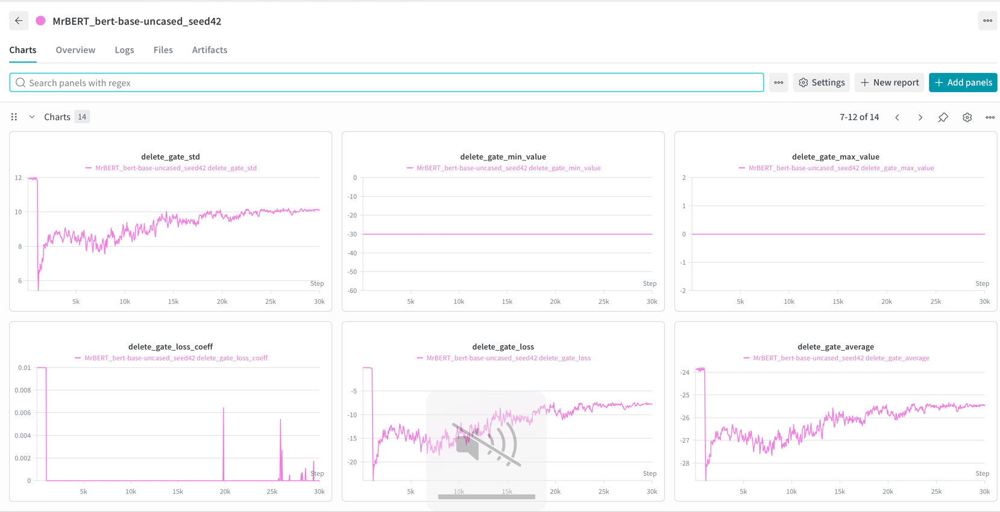

# MrBERT: BERT with MrT5-Style Delete Gates

**Author:** Hiva Mohammadzadeh  
**Course:** CS224N - Natural Language Processing with Deep Learning

This repository contains an implementation of **MrBERT**, which adapts the delete gate mechanism from the [MrT5 paper](https://arxiv.org/pdf/2410.20771) to the BERT architecture. The delete gate learns to selectively remove uninformative tokens during encoding, potentially improving computational efficiency while maintaining (or improving) task performance.

---

## Overview

The MrT5 paper introduced a **delete gate** mechanism that learns to remove redundant tokens during encoding. This can:
- **Reduce computational cost** by processing fewer tokens in later layers
- **Improve model focus** by removing uninformative tokens like punctuation or filler words
- **Potentially improve performance** by reducing noise in the representation

MrBERT adapts this idea to the encoder-only BERT architecture, enabling its use for tasks like:
- Masked Language Modeling (MLM)
- Text Classification
- Named Entity Recognition (NER)
- Question Answering
- And more...

### Key Features

- ✅ **Soft Deletion**: Masks attention scores (tokens still present, but ignored)
- ✅ **Hard Deletion**: Physically removes tokens from the sequence
- ✅ **Multiple Delete Gate Types**: Scaled sigmoid, log sigmoid, random, and fixed
- ✅ **Configurable Gate Placement**: Place the delete gate at any encoder layer
- ✅ **Gumbel Noise**: Optional exploration during training
- ✅ **Deletion Loss**: Auxiliary loss to encourage a target deletion rate
- ✅ **Full Task Support**: MLM, classification, token classification, QA, etc.

---

## Architecture

```
Input: [CLS] The quick brown fox [SEP]
         ↓
┌──────────────────────────────────────┐
│         BERT Embedding Layer          │
└──────────────────────────────────────┘
         ↓
┌──────────────────────────────────────┐
│         Encoder Layer 0               │
└──────────────────────────────────────┘
         ↓
┌──────────────────────────────────────┐
│         Encoder Layer 1               │
└──────────────────────────────────────┘
         ↓
┌──────────────────────────────────────┐
│   ★ DELETE GATE (default: Layer 2)   │  ← Learns which tokens to delete
│   ┌────────────────────────────────┐ │
│   │ LayerNorm → Linear → Sigmoid   │ │
│   └────────────────────────────────┘ │
│   Output: delete_mask per token      │
└──────────────────────────────────────┘
         ↓
   (Soft: mask attention | Hard: remove tokens)
         ↓
┌──────────────────────────────────────┐
│      Encoder Layers 2-11              │
│      (with delete mask applied)       │
└──────────────────────────────────────┘
         ↓
       Output
```
```

- **Soft Deletion**: `delete_gate_value` is added to attention scores (masking effect)
- **Hard Deletion**: Tokens with `delete_gate_value > threshold` are physically removed

---

## Installation

### Prerequisites

- Python 3.8+
- PyTorch 2.0+
- Transformers 4.39+

### Setup

```bash
# Clone the repository
git clone https://github.com/HivaMohammadzadeh1/CS224N-project.git
cd CS224N-project

# Create conda environment
conda create -n mrbert python=3.11 -y
conda activate mrbert

# Install dependencies
pip install modal torch transformers datasets accelerate tqdm matplotlib "numpy<2"

# For the original mrt5 code
cd mrt5
pip install -r requirements.txt
pip install transformers==4.39.1
```

---

## Configuration

### MrBertConfig Parameters

| Parameter | Type | Default | Description |
|-----------|------|---------|-------------|
| `delete_gate_layer` | int | 3 | Which encoder layer to place the delete gate (0-indexed) |
| `deletion_type` | str | "scaled_sigmoid" | Type of delete gate: `"scaled_sigmoid"`, `"log_sigmoid"`, `"random"`, `"fixed"` |
| `sigmoid_mask_scale` | float | -10.0 | Scale for sigmoid activation (more negative = stronger deletion) |
| `deletion_threshold` | float | None | Threshold for hard deletion. If None, uses soft deletion |
| `gate_layer_norm` | bool | True | Apply LayerNorm before delete gate |
| `use_gumbel_noise` | bool | False | Add Gumbel noise during training for exploration |
| `random_deletion_probability` | float | 0.5 | Deletion probability for random gate type |
| `fixed_deletion_amount` | float | 0.5 | Deletion fraction for fixed gate type |

---

## Training

The training script uses the HuggingFace `Trainer` class. All standard `TrainingArguments` flags apply directly alongside MrBERT-specific fields.

```bash
# Masked Language Modeling (default)
python train_mrbert.py \
    --task mlm \
    --dataset_name wikitext \
    --dataset_config wikitext-2-raw-v1 \
    --output_dir ./mrbert_checkpoints \
    --num_epochs 3 \
    --batch_size 16 \
    --learning_rate 5e-5 \
    --target_deletion_rate 0.3

# Sequence Classification on SNLI (MrBERT with delete gate)
python training/train_mrbert.py \
    --model_type MrBERT \
    --task sequence_classification \
    --dataset_name local_snli \
    --local_snli_dir ./snli_datasets \
    --output_dir ./mrbert_snli \
    --num_epochs 3 \
    --batch_size 32 \
    --target_deletion_rate 0.3 \
    --mode training-and-eval

# Baseline BERT (no delete gate)
python training/train_mrbert.py \
    --model_type BERT \
    --task sequence_classification \
    --dataset_name local_snli \
    --local_snli_dir ./snli_datasets \
    --output_dir ./bert_snli \
    --num_epochs 3 \
    --batch_size 32 \
    --mode training-and-eval

# Token Classification (e.g., NER)
python train_mrbert.py \
    --task token_classification \
    --dataset_name conll2003 \
    --output_dir ./mrbert_ner

# Question Answering (e.g., SQuAD)
python train_mrbert.py \
    --task question_answering \
    --dataset_name squad \
    --output_dir ./mrbert_squad

# Quick smoke test (100 steps, no W&B)
python train_mrbert.py \
    --max_steps 100 \
    --logging_steps 10 \
    --output_dir ./test_run \
    --disable_wandb
```

### Training Arguments

All standard `TrainingArguments` flags (e.g. `--per_device_train_batch_size`, `--num_train_epochs`, `--eval_steps`) work alongside the MrBERT-specific fields below. Backward-compat aliases `--batch_size` and `--num_epochs` are also supported.

**Model**

| Argument | Default | Description |
|----------|---------|-------------|
| `--model_type` | `MrBERT` | `MrBERT` (with delete gate) or `BERT` (baseline) |
| `--model_name` | `bert-base-uncased` | Pretrained BERT model to initialise from |
| `--delete_gate_layer` | `3` | Encoder layer that emits the delete gate (0-indexed) |
| `--deletion_type` | `scaled_sigmoid` | Gate type: `scaled_sigmoid`, `log_sigmoid`, `random`, `fixed` |
| `--use_softmax1` | `True` | Use softmax1 attention (recommended by MrT5 paper); `--no_use_softmax1` to disable |

**Dataset**

| Argument | Default | Description |
|----------|---------|-------------|
| `--task` | `mlm` | `mlm`, `sequence_classification`, `token_classification`, `question_answering` |
| `--dataset_name` | `wikitext` | HuggingFace dataset name, or `local_snli` / `local_mc4` for local files |
| `--dataset_config` | `wikitext-2-raw-v1` | Dataset config/subset (e.g. `sst2` for GLUE) |
| `--local_snli_dir` | `snli_datasets` | Directory with pre-processed SNLI NDJSON files |
| `--max_seq_length` | `512` | Max token sequence length |

**Training (HuggingFace TrainingArguments)**

| Argument | Default | Description |
|----------|---------|-------------|
| `--num_train_epochs` / `--num_epochs` | `3` | Number of training epochs |
| `--per_device_train_batch_size` / `--batch_size` | `8` | Per-device batch size |
| `--learning_rate` | `5e-5` | Learning rate (single LR for all parameters) |
| `--max_steps` | `-1` | Override max steps; `-1` = run full epochs |
| `--logging_steps` | `500` | Log metrics every N steps |
| `--eval_steps` | `500` | Run validation every N steps |
| `--save_steps` | `500` | Save checkpoint every N steps |

**Deletion Loss / PI Controller**

| Argument | Default | Description |
|----------|---------|-------------|
| `--target_deletion_rate` | `0.4` | Target fraction of non-pad tokens to delete |
| `--deletion_loss_weight` | `0.0` | Initial deletion loss coefficient α₀ |
| `--use_pi_controller` | `True` | Dynamically adjust α to hit target rate; `--no_use_pi_controller` to disable |
| `--controller_p` | `0.5` | Proportional gain for the PI controller |
| `--controller_i` | `5e-5` | Integral gain for the PI controller |
| `--regularizer_delay` | `0` | Steps to train on task loss only before enabling deletion regulariser |

**Mode / W&B**

| Argument | Default | Description |
|----------|---------|-------------|
| `--mode` | `training-only` | `training-only`, `training-and-eval`, `eval-only` |
| `--wandb_run_name` | auto | W&B run name (default: auto-generated) |
| `--disable_wandb` | `False` | Disable W&B logging entirely |

---

## Evaluation

```bash
# Evaluate a trained model
python eval_mrbert.py --model_path ./mrbert_checkpoints/final

# Evaluate on fresh MrBERT (no training)
python eval_mrbert.py --from_pretrained bert-base-uncased

# Specify evaluation dataset
python eval_mrbert.py \
    --model_path ./mrbert_checkpoints/final \
    --dataset_name wikitext \
    --dataset_config wikitext-2-raw-v1 \
    --num_samples 1000
```

### Evaluation Metrics

The evaluation script reports:

1. **MLM Perplexity**: How well the model predicts masked tokens
2. **Deletion Rate**: Average fraction of tokens deleted
3. **Token Analysis**: Which token types are most frequently deleted
4. **Deletion by Position**: Are early/late tokens deleted more often?
5. **Comparison with BERT**: MrBERT vs baseline BERT perplexity

---

## Supported Tasks

| Model Class | Task | Output |
|-------------|------|--------|
| `MrBertModel` | Base model | Hidden states + delete gate outputs |
| `MrBertForMaskedLM` | Masked Language Modeling | Token predictions |
| `MrBertForSequenceClassification` | Text Classification | Class logits |
| `MrBertForTokenClassification` | NER, POS Tagging | Per-token labels |
| `MrBertForQuestionAnswering` | Extractive QA | Start/end positions |
| `MrBertForMultipleChoice` | Multiple Choice | Choice logits |
| `MrBertForNextSentencePrediction` | NSP | Binary classification |
---

## File Structure

```
CS224N-project/
├── modeling_mrbert.py        # Main MrBERT model implementation
├── configuration_mrbert.py   # MrBertConfig class
├── train_mrbert.py           # Training script for multiple tasks
├── eval_mrbert.py            # Evaluation script
├── test_mrbert.py            # Test suite
├── modeling_bert.py          # Reference BERT implementation
├── README.md                 # This documentation
│
├── mrbert_checkpoints/       # Saved model checkpoints
│   └── final/
│       ├── config.json
│       ├── model.safetensors
│       └── tokenizer files...
│
└── mrt5/                     # Original MrT5 reference implementation
    ├── models/
    │   └── modeling_mrt5.py  # Original T5 with delete gates
    ├── data/
    ├── eval/
    └── training/
```

---

## Running on Modal

Train on a serverless GPU (e.g. T4) without managing machines:

```bash
# Install Modal and log in (one-time)
pip install modal
python3 -m modal setup

# Short test run (default: 20 steps)
modal run train_modal.py

# Longer run (e.g. 500 steps)
modal run train_modal.py --max-steps 500
```

Checkpoints are written to the Modal Volume `mrbert-checkpoints`. To download them locally after a run:

```bash
modal volume get mrbert-checkpoints final ./local_mrbert_final
# Or list first: modal volume ls mrbert-checkpoints
```

See `train_modal.py` for defaults and how to customize the training args (e.g. batch size, dataset) via the `train()` function.

---

## Testing

Run the test suite to verify the implementation:

```bash
python test_mrbert.py
```
  # List all running apps and get their IDs
  modal app list

  # Stop a specific app by ID
  modal app stop <app-id>
```

This runs tests for:
- ✅ Configuration creation
- ✅ Delete gate modules (all types)
- ✅ MrBertModel forward pass (soft deletion)
- ✅ MrBertModel forward pass (hard deletion)
- ✅ All task-specific model heads
- ✅ Gradient flow through delete gate
- ✅ Comparison with baseline BERT
---
# Local Testing

cd mrbert
python data/preprocess_snli.py --output_dir ./snli_datasets --max_samples 1000
python training/train_mrbert.py --model_type BERT --task sequence_classification --dataset_name local_snli --local_snli_dir ./snli_datasets --max_steps 50 --batch_size 8 --logging_steps 10 --output_dir ./bert_snli_test --disable_wandb
---
# metrics

⏺ For BERT (model_type=BERT), the delete gate is absent so delete_gate_output is None. Only task metrics are logged:                                                                                       
                                                                                                                                                                                                         
  ┌────────────────────┬────────────────────────────────────────────┐                                                                                                                                      
  │       Metric       │                Description                 │                                                                                                                                      
  ├────────────────────┼────────────────────────────────────────────┤                                                                                                                                      
  │ loss               │ Total loss (= task loss, no deletion term) │                                                                                                                                      
  ├────────────────────┼────────────────────────────────────────────┤
  │ cross_entropy_loss │ Cross-entropy over 3 SNLI classes          │
  ├────────────────────┼────────────────────────────────────────────┤
  │ total_loss         │ Same as loss                               │
  ├────────────────────┼────────────────────────────────────────────┤
  │ learning_rate      │ Current LR from scheduler                  │
  └────────────────────┴────────────────────────────────────────────┘

  For MrBERT (model_type=MrBERT), all of the above plus gate metrics:

  ┌────────────────────────────────┬───────────────────────────────────────────────────────┐
  │             Metric             │                      Description                      │
  ├────────────────────────────────┼───────────────────────────────────────────────────────┤
  │ delete_gate_loss               │ Mean gate value over non-pad tokens (drives deletion) │
  ├────────────────────────────────┼───────────────────────────────────────────────────────┤
  │ delete_gate_loss_coeff         │ Current α from PI-controller                          │
  ├────────────────────────────────┼───────────────────────────────────────────────────────┤
  │ percent_deleted_tokens         │ % non-pad tokens with gate < threshold                │
  ├────────────────────────────────┼───────────────────────────────────────────────────────┤
  │ percent_non_pad_deleted_tokens │ Same (both are identical in current code)             │
  ├────────────────────────────────┼───────────────────────────────────────────────────────┤
  │ delete_gate_average            │ Mean gate value across batch                          │
  ├────────────────────────────────┼───────────────────────────────────────────────────────┤
  │ delete_gate_std                │ Std of gate values per sequence, averaged over batch  │
  ├────────────────────────────────┼───────────────────────────────────────────────────────┤
  │ delete_gate_max_value          │ Mean of per-sequence max gate values                  │
  ├────────────────────────────────┼───────────────────────────────────────────────────────┤
  │ delete_gate_min_value          │ Mean of per-sequence min gate values                  │
  └────────────────────────────────┴───────────────────────────────────────────────────────┘

  All metrics are printed to stdout every --logging_steps steps. With --disable_wandb they won't be sent anywhere — just console output.

  Two things to watch for in the MrBERT run:
  - percent_deleted_tokens should gradually increase toward 30% (the --target_deletion_rate default) as the PI-controller ramps up α
  - delete_gate_average starting near 0 (from the bias=10 initialization) and drifting negative as the gate learns to delete

  
  ┌────────────────────────┬───────────────────────────────────────────────────────────────────────────────────────────────┐                                                                               
  │         Metric         │                                       What it measures                                        │
  ├────────────────────────┼───────────────────────────────────────────────────────────────────────────────────────────────┤                                                                               
  │ loss                   │ Total loss (task + α × deletion)                                                              │                                                                             
  ├────────────────────────┼───────────────────────────────────────────────────────────────────────────────────────────────┤                                                                               
  │ accuracy               │ Fraction of correct predictions in the batch                                                  │
  ├────────────────────────┼───────────────────────────────────────────────────────────────────────────────────────────────┤
  │ new_seq_len            │ Mean number of tokens kept per sequence (gate > threshold for MrBERT; non-pad count for BERT) │
  ├────────────────────────┼───────────────────────────────────────────────────────────────────────────────────────────────┤
  │ percent_deleted_tokens │ % non-pad tokens deleted by the gate (0 for BERT baseline)                                    │
  └────────────────────────┴───────────────────────────────────────────────────────────────────────────────────────────────┘

  All four appear in both stdout and wandb. The progress bar also now shows loss + acc per step.
---
  With k_p=0.01, the proportional term adds at most 0.1 * 0.01 * 0.3 = 0.0003 per step, and the integral term adds 0.00001 * 0.3 = 0.000003 per step — α will rise to ~0.01 over thousands of steps rather 
  than hundreds.
                                                                                                                                                                                                           
  Watch for delete_gate_loss_coeff staying near 0.01 for the first few hundred steps post-delay — that's the sign it's working correctly.
---
 ## Monitoring with Modal

  No, Modal doesn't support SSH into running containers. It's a serverless platform — you don't get direct shell access to the machine running your job.                                                   
                                                                                                                                                                                                         
  What you can do instead:                                                                                                                                                                                 
                                                                                                                                                                                                           
  1. Stream logs in real time (best option):                                                                                                                                                               
  modal app logs mrbert-train                                                                                                                                                                              

  2. Watch a specific run:
  modal container list  # get the container ID
  modal container exec <container-id> /bin/bash  # Modal does support this for running containers
  `modal container exec is the closest equivalent to SSH — it drops you into a shell in the running container. Check if your container ID is listed while the job is running.`

  3. Monitor via wandb — since you have wandb hooked up, the live metrics at https://wandb.ai/aronima7-stanford-university/mrbert are the most practical way to watch training without shell access.

  4. Add more logging to train_mrbert.py if you need to debug something specific — the output streams back through modal app logs.
---
 # nvidia GPU specs

 modal container list
 ┏━━━━━━━━━━━━━━━━━━━━━━━━━━━━━━━┳━━━━━━━━━━━━━━━━━━━━━━━━━━━┳━━━━━━━━━━━━━━┳━━━━━━━━━━━━━━━━━━━━━━┓
┃ Container ID                  ┃ App ID                    ┃ App Name     ┃ Start Time           ┃
┡━━━━━━━━━━━━━━━━━━━━━━━━━━━━━━━╇━━━━━━━━━━━━━━━━━━━━━━━━━━━╇━━━━━━━━━━━━━━╇━━━━━━━━━━━━━━━━━━━━━━┩
│ ta-01KJDGZ2KKTAK60ZR4P2S344AS │ ap-npSr8kooNdWuOqP3EtarIO │ mrbert-train │ 2026-02-26 09:46 PST │
│ ta-01KJDDS2N4R5CK8KTKE89D4BCJ │ ap-JquTj9JSdBlWFOL55k32ia │ mrbert-train │ 2026-02-26 08:51 PST │
└───────────────────────────────┴───────────────────────────┴──────────────┴──────────────────────┘
 modal container exec ta-01KJDGZ2KKTAK60ZR4P2S344AS /bin/bash

 root ~ → nvidia-smi
Thu Feb 26 17:53:14 2026       
+-----------------------------------------------------------------------------------------+
| NVIDIA-SMI 580.95.05              Driver Version: 580.95.05      CUDA Version: 13.0     |
+-----------------------------------------+------------------------+----------------------+
| GPU  Name                 Persistence-M | Bus-Id          Disp.A | Volatile Uncorr. ECC |
| Fan  Temp   Perf          Pwr:Usage/Cap |           Memory-Usage | GPU-Util  Compute M. |
|                                         |                        |               MIG M. |
|=========================================+========================+======================|
|   0  NVIDIA A100-SXM4-40GB          On  |   00000000:80:00.0 Off |                    0 |
| N/A   61C    P0            295W /  400W |    5233MiB /  40960MiB |     93%      Default |
|                                         |                        |             Disabled |
+-----------------------------------------+------------------------+----------------------+

+-----------------------------------------------------------------------------------------+
| Processes:                                                                              |
|  GPU   GI   CI              PID   Type   Process name                        GPU Memory |
|        ID   ID                                                               Usage      |
|=========================================================================================|
|    0   N/A  N/A               1      C   /bin/dumb-init                         5224MiB |
+-----------------------------------------------------------------------------------------+
---
# Stop modal training run

  modal app stop mrbert-train                                                                                                                                                                              
                                                                                                                                                                                                         
  Or if you want to stop a specific run without killing the whole app:                                                                                                                                     
  modal app list                    # get the app ID                                                                                                                                                       
  modal app stop <app-id>                                                                                                                                                                                  
                                                                                                                                                                                                           
  You can also cancel from the Modal dashboard at https://modal.com/apps — find mrbert-train and click Stop.
---
# GCP

 ● Do you have an existing GCP project with A100 quota?             
   → Existing GCP project
 ● How do you want to run training on GCP?                                                                                                                                                                 
   → Vertex AI custom job
 ● Where should checkpoints be saved?                                                                                                                                                                      
   → GCS bucket 

 ● Do you want to hardcode your GCP project ID and region, or use placeholders?                                                                                                                            
   → Use placeholders                                                                                                                                                                                      
 ● How should the training environment be packaged?                                                                                                                                                        
   → Custom Docker image                                                                                                                                                                                   
 ● Do you have an existing GCS bucket for checkpoints?                                                                                                                                                     
   → New bucket 

❯ 1. [✔] gcloud CLI ready                                                                                                                                                                                  
  gcloud is installed and authenticated (gcloud auth login done)                                                                                                                                           
  2. [✔] Vertex AI API enabled                                                                                                                                                                           
  Vertex AI API is enabled in the project
  3. [✔] Artifact Registry API enabled
  Artifact Registry API is enabled

 ---
  GCP Vertex AI

  One-time setup — fill in your values at the top of train_gcp.py:                                                                                                                                         
  GCP_PROJECT = "your-project-id"
  GCP_REGION  = "us-central1"                                                                                                                                                                              
  GCS_BUCKET  = "your-bucket-name"                                                                                                                                                                       

  Create the GCS bucket:
  gsutil mb -l us-central1 gs://YOUR_BUCKET_NAME

  Build and push the Docker image:
  cd /Users/aronimadass/Desktop/projects/stanford/CS224N-project/mrbert/training && python train_gcp.py --build-image

  Preprocess SNLI to GCS (one-time):
  python train_gcp.py --preprocess-snli

  Submit training jobs:
  python train_gcp.py --model-type MrBERT --max-steps 30000
  python train_gcp.py --model-type BERT --max-steps 30000

  Download checkpoints:
  gsutil -m cp -r gs://YOUR_BUCKET/checkpoints/mrbert-mrbert-30000steps ./local_mrbert_checkpoints

  Install the required local deps first:
  pip install google-cloud-aiplatform google-cloud-storage
 ---  
  GCP GCE A100
  Key differences vs Vertex AI:

  ┌─────────────────────────┬────────────┬────────────────────────────────┐
  │                         │ Vertex AI  │             GCE VM             │
  ├─────────────────────────┼────────────┼────────────────────────────────┤
  │ SSH access              │ No         │ Yes                            │
  ├─────────────────────────┼────────────┼────────────────────────────────┤
  │ Startup overhead        │ ~5 min     │ ~2 min                         │
  ├─────────────────────────┼────────────┼────────────────────────────────┤
  │ Auto-stop on completion │ Yes        │ No — you pay until you stop it │
  ├─────────────────────────┼────────────┼────────────────────────────────┤
  │ Checkpoint persistence  │ GCS bucket │ Local disk or GCS              │
  ├─────────────────────────┼────────────┼────────────────────────────────┤
  │ Job queuing             │ Yes        │ No                             │
  └─────────────────────────┴────────────┴────────────────────────────────┘

  The pytorch-latest-gpu image from deeplearning-platform-release comes with CUDA, PyTorch, and conda pre-installed, so you can clone the repo and run train_mrbert.py directly without Docker.
 --- 
⏺ Created train_gce.py. Here's a summary of usage:                                                                                                                                                       
                                                                                                                                                                                                           
  Full training run (VM stops when done):                                                                                                                                                                  
  python train_gce.py --project YOUR_PROJECT --bucket YOUR_BUCKET --model-type MrBERT --max-steps 30000                                                                                                    
                                                                                                                                                                                                           
  Delete VM after training (cheapest option):                                                                                                                                                            
  python train_gce.py --project YOUR_PROJECT --bucket YOUR_BUCKET --model-type MrBERT --max-steps 30000 --delete-vm                                                                                      

  SSH into the running VM:
  python train_gce.py --project YOUR_PROJECT --ssh

  Stop or delete VM manually:
  python train_gce.py --project YOUR_PROJECT --stop-vm
  python train_gce.py --project YOUR_PROJECT --delete-vm-only

  Skip re-uploading code on a second run:
  python train_gce.py --project YOUR_PROJECT --bucket YOUR_BUCKET --model-type BERT --max-steps 30000 --skip-upload --skip-setup

  The script handles the full lifecycle: creates the VM, uploads code, installs deps, preprocesses SNLI (or downloads from GCS if already done), runs training, uploads checkpoints to GCS, then
  stops/deletes the VM.
 --- 
ARONIMA RUNS

  SNLI task

  cd mrbert
  python data/preprocess_snli.py --output_dir ./snli_datasets --max_samples 1000
  python training/train_mrbert.py --model_type MrBERT --task sequence_classification --mode training-and-eval --dataset_name local_snli --local_snli_dir ./snli_datasets --max_steps 50 --batch_size 8 --logging_steps 10 --output_dir ./bert_snli_test --disable_wandb

  python train_gcp.py --model-type MrBERT --max-steps 30000
  python train_gcp.py --model-type BERT --max-steps 30000

  modal run --detach train_modal.py --model-type MrBERT --max-steps -1 --num-epochs 3 --target-deletion-rate 0.3 --mode training-and-eval --delete-gate-layer 3
  modal run --detach train_modal.py --model-type BERT --max-steps -1 --num-epochs 3 --mode training-and-eval

  no PI
  modal run --detach train_modal.py --model-type MrBERT --max-steps -1 --num-epochs 3 --target-deletion-rate 0.3 --mode training-and-eval --no-use-pi-controller
---
  Q&A task

  cd mrbert
  python data/preprocess_squad.py --output_dir ./squad_datasets --max_samples 1000
  python training/train_mrbert.py --model_type MrBERT --task question_answering --mode training-only --dataset_name local_squad --local_squad_dir ./squad_datasets --max_steps 100 --max_train_samples 200 --max_eval_samples 200 --batch_size 8 --logging_steps 10 --eval_steps 50 --output_dir ./mrbert_squad_test --disable_wandb  --deletion_loss_weight 0.1  --target_deletion_rate 0.3  
--- 
  tydiQA, SST-2, mrpc, imdb
  LOCAL 

  # --- Preprocess first (for local/Modal use) ---
  cd mrbert/data
  python preprocess_sst2.py --output_dir ../sst2_datasets
  python preprocess_mrpc.py --output_dir ../mrpc_datasets
  python preprocess_imdb.py --output_dir ../imdb_datasets
  python preprocess_tydiqa.py --output_dir ../tydiqa_datasets

  # --- Train with local files ---
  python train_mrbert.py --task sequence_classification --dataset_name local_sst2 --output_dir ./mrbert_sst2
  python train_mrbert.py --task sequence_classification --dataset_name local_mrpc --output_dir ./mrbert_mrpc
  python train_mrbert.py --task sequence_classification --dataset_name local_imdb --output_dir ./mrbert_imdb
  python train_mrbert.py --task question_answering      --dataset_name local_tydiqa --output_dir ./mrbert_tydiqa

  # --- Or load directly from HuggingFace (SST-2/MRPC already worked; now IMDB and TyDi QA too) ---
  python train_mrbert.py --task sequence_classification --dataset_name glue --dataset_config sst2 --output_dir ./mrbert_sst2
  python train_mrbert.py --task sequence_classification --dataset_name glue --dataset_config mrpc --output_dir ./mrbert_mrpc
  python train_mrbert.py --task sequence_classification --dataset_name stanfordnlp/imdb --output_dir ./mrbert_imdb
  python train_mrbert.py --task question_answering      --dataset_name tydiqa --dataset_config secondary_task --output_dir ./mrbert_tydiqa

  # All of the above work with --model_type BERT for baseline or MrBERT (default)
---
  Modal                                                                                                                                                                                            
                                                                                                                                                                                                         
  SST-2                                                                                                                                                                                                    
                                                                                                                                                                                                         
  # MrBERT on SST-2
  modal run --detach mrbert/training/train_modal.py \
    --task sequence_classification --dataset-name local_sst2 \
    --model-type MrBERT --num-epochs 3 --wandb-run-name mrbert-sst2-30pct

  # BERT baseline on SST-2
  modal run --detach mrbert/training/train_modal.py \
    --task sequence_classification --dataset-name local_sst2 \
    --model-type BERT --num-epochs 3 --wandb-run-name bert-sst2-baseline

  MRPC

  # MrBERT on MRPC
  modal run --detach mrbert/training/train_modal.py \
    --task sequence_classification --dataset-name local_mrpc \
    --model-type MrBERT --num-epochs 3 --wandb-run-name mrbert-mrpc-30pct

  # BERT baseline on MRPC
  modal run --detach mrbert/training/train_modal.py \
    --task sequence_classification --dataset-name local_mrpc \
    --model-type BERT --num-epochs 3 --wandb-run-name bert-mrpc-baseline

  IMDB

  # MrBERT on IMDB
  modal run --detach mrbert/training/train_modal.py \
    --task sequence_classification --dataset-name local_imdb \
    --model-type MrBERT --num-epochs 3 --wandb-run-name mrbert-imdb-30pct

  # BERT baseline on IMDB
  modal run --detach mrbert/training/train_modal.py \
    --task sequence_classification --dataset-name local_imdb \
    --model-type BERT --num-epochs 3 --wandb-run-name bert-imdb-baseline

  TyDi QA

  # MrBERT on TyDi QA
  modal run --detach mrbert/training/train_modal.py \
    --task question_answering --dataset-name local_tydiqa \
    --model-type MrBERT --num-epochs 3 --wandb-run-name mrbert-tydiqa-30pct

  # BERT baseline on TyDi QA
  modal run --detach mrbert/training/train_modal.py \
    --task question_answering --dataset-name local_tydiqa \
    --model-type BERT --num-epochs 3 --wandb-run-name bert-tydiqa-baseline
---
  Download checkpoints

  modal volume get mrbert-checkpoints mrbert-sst2-30pct/final    ./local_checkpoints/mrbert-sst2
  modal volume get mrbert-checkpoints bert-sst2-baseline/final   ./local_checkpoints/bert-sst2
  modal volume get mrbert-checkpoints mrbert-mrpc-30pct/final    ./local_checkpoints/mrbert-mrpc
  modal volume get mrbert-checkpoints mrbert-imdb-30pct/final    ./local_checkpoints/mrbert-imdb
  modal volume get mrbert-checkpoints mrbert-tydiqa-30pct/final  ./local_checkpoints/mrbert-tydiqa

  Quick smoke tests (20 steps, no --detach)

  modal run mrbert/training/train_modal.py --task sequence_classification --dataset-name local_sst2
  modal run mrbert/training/train_modal.py --task sequence_classification --dataset-name local_mrpc
  modal run mrbert/training/train_modal.py --task sequence_classification --dataset-name local_imdb
  modal run mrbert/training/train_modal.py --task question_answering      --dataset-name local_tydiqa
---
❯ how many epochs will give me viable results?                                                                                                                                                             
  ⎿  ⧉ Selected 1 lines from mrbert/README.md in PyCharm                                                                                                                                                 
                                                                                                                                                                                                           
⏺ That's a research/empirical question rather than a code question, and the answer depends on what you observe during training. A few guidelines based on standard NLI fine-tuning practice:             
                                                                                                                                                                                                           
  Typical BERT fine-tuning on SNLI:                                                                                                                                                                        
  - 3–5 epochs is the standard range in the literature                                                                                                                                                     
  - BERT-base usually converges on SNLI within 3 epochs (validation accuracy ~90-91%)                                                                                                                      
  - Beyond 5 epochs you risk overfitting

  For MrBERT specifically:
  - You may need more epochs than baseline BERT because the delete gate needs time to learn — the --regularizer_delay 1000 already accounts for this by letting the model learn the task before applying
  deletion pressure
  - The PI controller adjusting deletion_loss_weight also needs steps to stabilize
  - 3 epochs is a reasonable starting point, but you may want to run 5 if the gate hasn't converged

  Practical advice:
  - Watch the validation accuracy and deletion rate in the logs
  - If the deletion rate hasn't hit the 30% target by the end of epoch 1, the gate is still learning and more epochs will help
  - If validation accuracy is still climbing at the end of epoch 3, run more

  There's no substitute for actually looking at your training curves. If you have W&B set up, that'll make it easy to decide whether to run longer.
---
W&B metrics logged by the eval loop: eval/loss, eval/accuracy, eval/percent_deleted_tokens, eval/avg_seq_len.
---
ANALYSIS

⏺ A few observations:                                                                                                                                                                                      
                                                                                                                                                                                                           
  The PI controller is working — the deletion rate is slowly converging toward the 30% target. By step 30k it's sitting around 25-27%, close but not quite there yet.                                      
                                                                                                                                                                                                           
  The early spike (~80% at step ~2k) is expected — this is before the PI controller has stabilized. The gate starts deleting aggressively, then the controller pulls it back.                              
                  
  The two charts are identical — percent_deleted_tokens and percent_non_pad_deleted_tokens show the same curve, which means the deletion rate calculation isn't actually distinguishing between pad and
  non-pad tokens. This is a bug in the logging — both metrics are set to the same value (avg_del_pct) in train_mrbert.py:

  "percent_deleted_tokens": round(avg_del_pct, 4),
  "percent_non_pad_deleted_tokens": round(avg_del_pct, 4),

  The convergence is slow — still trending downward at step 30k, suggesting the model hasn't fully settled. This supports running longer (3 full epochs / ~51k steps) to see if it stabilizes at 30%.

  The high variance throughout (±10-15%) suggests the PI controller gains (controller_p=0.01, controller_i=0.00001) may be too low, causing sluggish correction. If you want faster convergence to 30%, you
   could try increasing controller_p.
---
A few observations:                                                                                                                                                                                      
                                                                                                                                                                                                           
  Loss is healthy                                                                                                                                                                                          
  - Total loss drops cleanly from ~1.1 to ~0.7, still trending down at step 30k. The model hasn't converged — it would benefit from more steps.                                                            
                                                                                                                                                                                                           
  Deletion rate is not converging to 30%
  - Both percent_non_pad_deleted_tokens and percent_deleted_tokens are nearly identical (~25-27% at step 30k), which is suspicious — with padding in SNLI sequences the all-token rate should be noticeably
   lower than the non-pad rate. Worth double-checking the fix took effect.
  - More importantly: the target is 30% but it's plateauing around 25-27%. The PI controller isn't pushing it up enough, likely because controller_p=0.01 and controller_i=0.00001 are too conservative.

  new_seq_len trend is concerning
  - Effective sequence length starts at ~5-6, spikes to ~25, then slowly climbs to ~20. The early low values (steps 1k-5k) suggest the gate was deleting almost everything before the PI controller kicked
  in. By step 30k it's stabilizing around 19-20 tokens — that's very aggressive deletion given SNLI sequences are typically 20-40 tokens after tokenization.

  Learning rate is nearly exhausted
  - The linear decay has brought LR almost to zero by step 30k. This means running more steps without adjusting the schedule won't help much — the LR scheduler was configured for 30k steps. If you train
  for 51k steps, you should set --max-steps -1 so the scheduler recalculates total_steps from num_epochs rather than being set to 30k.

  Summary: the model is learning but the gate hasn't reached target. Running 3 full epochs with a corrected LR schedule is the right next step.
---
❯   Loss is healthy                                                                                                                                                                                        
                                                                                                                                                                                                       
    - Total loss drops cleanly from ~1.1 to ~0.7, still trending down at step 30k. The model hasn't converged — it would benefit from more steps.                                                          
                                                                                                                                                                                                       
  do you expect to see the loss plateau once the model has converged instead of trending downwards?                                                                                                        
                                                                                                                                                                                                           
⏺ Yes — for a well-behaved training run you'd expect the training loss to flatten out as the model saturates its capacity on the data. The fact that it's still trending down at step 30k just means it    
  hasn't reached that plateau yet.                                                                                                                                                                         
                                                                                                                                                                                                           
  That said, training loss alone isn't the right convergence signal here. What you actually want to watch is validation accuracy — training loss can keep slowly decreasing due to mild overfitting even   
  after validation accuracy has peaked. That's why the eval loop matters: you could be at 91% val accuracy already and the loss curve wouldn't tell you that.  
---
❯   new_seq_len trend is concerning                                                                                                                                                                        
    - Effective sequence length starts at ~5-6, spikes to ~25, then slowly climbs to ~20. The early low values (steps 1k-5k) suggest the gate was deleting almost everything before the PI controller  
  kicked                                                                                                                                                                                                   
    in. By step 30k it's stabilizing around 19-20 tokens — that's very aggressive deletion given SNLI sequences are typically 20-40 tokens after tokenization.                                             
                                                                                                                                                                                                           
                                                                                                                                                                                                           
  do we need to adjust anything to account for this concern? 
  
  The gate initialization is already designed to prevent this — _init_delete_gates() sets bias=10 so initial gate values are ≈ 0, well above the -15 threshold, meaning all tokens should be kept at the
  start. The early low new_seq_len of 5-6 is inconsistent with that initialization working correctly.

  The most useful diagnostic: look at delete_gate_average in W&B at the very first logging step (step 50). If it's close to 0, the initialization is fine and the early seq_len drop has another cause. If
  it's close to -30, the initialization isn't taking effect.

  That said, two adjustments worth considering regardless:

  1. Increase regularizer_delay — currently 1000 steps. Bumping to 2000-3000 gives the model more time to learn the classification task before deletion pressure engages. This is a safe change with no
  downside.
  2. The PI controller gains may need tuning — the current controller_p=0.01 is deliberately conservative (to prevent gate collapse), but it means the controller responds slowly when the deletion rate
  drifts far from target. The early spike to ~80% then slow recovery to 25-27% is a symptom of this. Increasing controller_p to 0.05 would make it respond faster, but risks overshooting in the other
  direction.

  Neither of these is urgent — the model IS learning and the gate IS broadly working. The early instability settles out. The more important issue remains the LR schedule: if you run 3 epochs (~51k steps)
   the scheduler needs to be recalculated for that budget, otherwise LR decays to near zero by step 30k and the remaining 21k steps train with almost no gradient signal.
---
 ❯ explain steps and epochs in the context of training runs                                                                                                                                                 
                                                           
⏺ Step: one forward + backward pass on a single batch. Each step the model sees batch_size examples and updates its weights once.                                                                          
                                                                                                                                                                                                           
  Epoch: one full pass through the entire training dataset. With 549,367 SNLI examples and batch size 32, one epoch = ~17,168 steps.                                                                       
                  
  The relationship:                                                                                                                                                                                        
  steps_per_epoch = dataset_size / batch_size                                                                                                                                                              
  total_steps     = steps_per_epoch × num_epochs

  So for this training setup:
  1 epoch  ≈  17,168 steps
  3 epochs ≈  51,500 steps

  Why the distinction matters here: the LR scheduler decays linearly from learning_rate to 0 over total_steps. If you set --max-steps 30000 but train for 51k steps, the LR hits near-zero at step 30k and
  the last 21k steps are nearly useless. If you use --max-steps -1, the scheduler correctly sets total_steps = 51,500 and the LR decays smoothly over all 3 epochs.
---
⏺ Yes. Running without the PI controller means α (the deletion loss weight) stays fixed at whatever --deletion_loss_weight is set to, rather than being dynamically adjusted to hit the target deletion  
  rate.                                                                                                                                                                                                    
                                                                                                                                                                                                           
  What it signifies: You're applying a constant, fixed pressure on the gate to delete tokens, regardless of whether the actual deletion rate is above or below the target. The model has to find its own   
  equilibrium between task loss and deletion loss — there's no feedback mechanism correcting it toward 30%. In practice this means:                                                                        
                  
  - The deletion rate may settle anywhere, not necessarily near the target
  - If --deletion_loss_weight is too high, the gate collapses (deletes too much)
  - If too low, the gate learns to delete nothing
  - It's a useful ablation to show the PI controller is necessary for stable, targeted deletion

  The PI controller is already configurable — --use_pi_controller is a flag in train_mrbert.py (line 249, default True). You just need to expose it in train_modal.py. Want me to add it?
---
  modal run --detach train_modal.py --model-type MrBERT --max-steps -1 --num-epochs 3 --mode training-and-eval --no-use-pi-controller

  With --no-use-pi-controller, α stays fixed at --deletion_loss_weight (default 0.01) for the entire run. If you want stronger fixed deletion pressure, pair it with a higher value, e.g. pass
  --deletion_loss_weight 0.1 via extra_args.
---
change location of deletion gate (default is 3)
  # Run 6: gate at layer 1                                                                                                                                                                                 
  modal run --detach train_modal.py --model-type MrBERT --max-steps -1 --num-epochs 3 --target-deletion-rate 0.3 --mode training-and-eval --delete-gate-layer 1
                                                                                                                                                                                                           
  # Run 7: gate at layer 6                                                                                                                                                                               
  modal run --detach train_modal.py --model-type MrBERT --max-steps -1 --num-epochs 3 --target-deletion-rate 0.3 --mode training-and-eval --delete-gate-layer 6
---
run training + eval in one go
run for 3 epochs

vary deletion percentage (20, 30, 50)
run with/without pi controller
run with gate at layer 1, 3, 6
---
 For the modal run: "modal run --detach train_modal.py --model-type MrBERT --max-steps -1 --num-epochs 3 --target-deletion-rate 0.3 --mode training-and-eval --delete-gate-layer 3 --wandb-run-name       
  run1-mrbert-deletion_rate_30pct", following is the eval result:                                                                                                                                          
    eval/loss: 0.5483                                                                                                                                                                                      
    eval/accuracy: 0.78                                                                                                                                                                                    
    eval/percent_deleted_tokens: 33.6186                                                                                                                                                                   
    eval/avg_seq_len: 18.22                                                                                                                                                                                
  What is your analysis and recommendation for next run?                                                                                                                                                   
  ⎿ [Image #9]                                                                                                                                                                                            
  ⎿ [Image #10]                                                                                                                                                                                           
  ⎿ [Image #11]                                                                                                                                                                                           
  ⎿ [Image #12]
---
⏺ This is because percent_deleted_tokens (the W&B training metric) and eval/percent_deleted_tokens (the eval metric) are measuring different things:                                                       
                                                                                                                                                                                                           
  - Training chart (percent_deleted_tokens): fraction of all tokens deleted, including padding. With max_seq_length=128 and SNLI sequences averaging ~26 non-pad tokens, ~80% of each sequence is padding. 
  Padding is always forced to gate value -30 (always deleted). So ~80% padding deletion + ~30% of non-pad deleted = ~86% all-token deletion. This is expected.                                             
  - Eval result (eval/percent_deleted_tokens: 33.6%): this is using percent_deleted from compute_deletion_loss, which only counts non-pad tokens. So 33.6% means 33.6% of actual content tokens were       
  deleted — right on the 30% target.

  So the two numbers are consistent — they're just measuring different denominators. The 86% figure is dominated by padding and is misleading as a headline metric. The 33.6% non-pad figure is the one
  that actually matters.

  This also confirms the earlier observation: the two W&B training metrics percent_deleted_tokens and percent_non_pad_deleted_tokens should be showing ~86% and ~30% respectively — if they're both showing
   ~86%, the fix we made to compute_deletion_loss to return separate values may not have taken effect in this run (it was run before that fix). Worth checking on the next run.
---
 --controller-p

 To run with faster PI controller convergence:

  modal run --detach train_modal.py --model-type MrBERT --max-steps -1 --num-epochs 3 --target-deletion-rate 0.3 --mode training-and-eval --controller-p 0.05 --wandb-run-name                             
  run3-mrbert-controller_p_0.05
---
❯ explain cross entropy loss and training accuracy to me in the context of your analysis:                                                                                                                  
    1. The model hasn't converged — training accuracy is still rising at step 51k and cross_entropy_loss is still declining. The model needs more epochs.                                                 
                                                                                                                                                                                                           
⏺ Cross-entropy loss measures how confident and correct the model's predictions are. For a 3-class problem (entailment/neutral/contradiction), it outputs a probability distribution over the 3 classes.   
  Cross-entropy penalizes the model when it assigns low probability to the correct class:                                                                                                                  
                                                                                                                                                                                                           
  - Loss = 1.1 → model is essentially guessing (random = log(3) ≈ 1.1)                                                                                                                                     
  - Loss = 0.5 → model is moderately confident and mostly correct                                                                                                                                          
  - Loss = 0.0 → model is perfectly confident on every example

  Training accuracy is simpler — just the fraction of training batches where argmax(logits) == true_label.

  Why both matter for convergence:

  They're measuring the same thing from different angles. In a converged model you expect both to plateau — accuracy stops rising and loss stops falling because the model has extracted all the signal it
  can from the data.

  In Run 1 at step 51k:
  - cross_entropy_loss was still declining (hadn't flattened)
  - accuracy was still rising (hadn't flattened)

  Both curves still had positive slope, meaning the model was still actively learning. A converged model's curves look flat for the last 5,000–10,000 steps. The fact that both were still moving at the
  end of epoch 3 means epoch 3 was not the ceiling — more epochs would have continued improving the model.

  This is why 0.78 eval/accuracy is likely an underestimate of what MrBERT can achieve — the model simply hadn't finished training.
---
 use_softmax1 default changed from False → True
To disable it explicitly:                                                                                                                                                                              
  modal run --detach train_modal.py --model-type MrBERT ... --no-use-softmax1
---
 Yes, it does impact the analysis in a few specific ways:  

  Run 1 used use_softmax1=False                                                                                                                                                                            
   
  The Run 1 results (eval/accuracy: 0.78, ~33% deletion rate) were produced with standard softmax — meaning when tokens were soft-deleted (large negative attention bias), their attention mass            
  redistributed to remaining tokens. This is architecturally incorrect for a deletion model: you're suppressing a token but inadvertently boosting attention on others.                                  

  What softmax1 changes

  With use_softmax1=True, attention weights can sum to < 1. When a token is suppressed by the gate, its attention "falls off" rather than flowing to neighbors. This is the behavior the MrT5 paper
  designed for — the gate and attention variants are meant to work together.

  Concrete implications for your analysis:

  1. Run 1 accuracy (0.78) is a slightly pessimistic baseline for MrBERT. Future runs with softmax1=True may see a small accuracy improvement simply from the attention fix, independent of any other
  changes.
  2. Fair comparison is now compromised. Run 1 (softmax1=False) vs. Run 2+ (softmax1=True) conflates two variables. If accuracy improves, you can't attribute it solely to hyperparameter changes.
  3. The BERT baseline is also affected. Even without deletion, softmax1 changes attention behavior. For a fair comparison, the BERT baseline run should use consistent use_softmax1 settings relative to
  whichever MrBERT runs it's being compared against.

  Recommendation:

  Re-run the BERT baseline and at least one MrBERT run (your primary 30% deletion run) with use_softmax1=True before drawing conclusions. The softmax variant should be held constant across all
  comparisons you report. Since use_softmax1=True is now the default and aligns with the MrT5 paper, treat it as the correct setting going forward and treat Run 1 as a preliminary/exploratory run rather
  than a reportable result.
---
Modal logs:
look for 'Starting training...' to see the initial params for training run
look for ''
---
Analysis:

⏺ Three scripts created under mrbert/analysis/. Here's what each does and how they connect:

  ---
  Workflow

  # Step 1 — run model over SNLI test, save gate decisions
  python analysis/get_deletion_patterns.py \
      --model_path ./mrbert_checkpoints/final \
      --local_snli_dir ./snli_datasets \
      --sample_size 1000 \
      --output_dir ./analysis/deletion_patterns

  # Step 2 — analyse patterns from step 1
  python analysis/deletion_pattern_analysis.py \
      --input_file ./analysis/deletion_patterns/final_test.json \
      --output_dir ./analysis/figures

  # Step 3 — compute/plot theoretical MACs savings (no model needed)
  python analysis/compute_savings.py

  ---
  Script breakdown

  Script: get_deletion_patterns.py
  MrT5 equivalent: get_deletion_patterns.py
  What it does: Runs MrBertForSequenceClassification over SNLI; saves per-token gate_values, deletion_mask, prediction, label to JSON
  ────────────────────────────────────────
  Script: compute_savings.py
  MrT5 equivalent: compute_savings.ipynb
  What it does: BERT-specific MACs formula (encoder-only, no decoder); plots relative compute vs deletion ratio; two figures: gate@layer3 and gate@layer 1/3/6/9
  ────────────────────────────────────────
  Script: deletion_pattern_analysis.py
  MrT5 equivalent: deletion_pattern_analysis.ipynb
  What it does: Loads JSON from step 1; colored terminal output; deletion rates by token type; top most/least deleted tokens; SNLI-specific premise vs hypothesis deletion rates; saves bar charts

  Key SNLI-specific addition not in MrT5: the premise vs hypothesis breakdown — whether MrBERT preferentially deletes more from the premise or hypothesis segment.

✻ Churned for 4m 31s

❯ how and when do you recommend running analysis, ie, do I need to run this for each run or only the final run?                                                                                           
                                                                                                                
⏺ Run analysis on selected runs only, not every run. Here's the reasoning and a concrete recommendation:                                                                                                  
                                                                                                                                                                                                        
  ---                                                                                                                                                                                                     
  What analysis tells you vs what W&B already tells you
                                                                                                                                                                                                          
  W&B already gives you the key training signals during a run: accuracy, loss, deletion rate, gate average/std, alpha. You don't need the analysis scripts to decide whether a run is good.               

  The analysis scripts answer different questions:
  - Which tokens is the gate choosing to delete? (semantic interpretation)
  - Is the gate deleting more from premise or hypothesis? (SNLI-specific behaviour)
  - What is the actual compute saving at a given deletion rate? (paper numbers)

  These are paper-writing questions, not training decisions.

  ---
  Recommended timing

  compute_savings.py — run once, now. It requires no model, just the deletion rate numbers from your runs. You can already plug in 30% and 50% to get the theoretical savings figures for your paper.

  python analysis/compute_savings.py

  get_deletion_patterns.py + deletion_pattern_analysis.py — run on two or three specific checkpoints at the end:

  ┌──────────────────────────────────────┬──────────────────┬─────────────────────────────────────────────────────────────────────────┐
  │                 When                 │ Which checkpoint │                                   Why                                   │
  ├──────────────────────────────────────┼──────────────────┼─────────────────────────────────────────────────────────────────────────┤
  │ After your best MrBERT run converges │ Final checkpoint │ Primary results for the paper — what does the trained gate actually do? │
  ├──────────────────────────────────────┼──────────────────┼─────────────────────────────────────────────────────────────────────────┤
  │ After the 50% deletion run           │ Final checkpoint │ Compare deletion patterns at different rates                            │
  ├──────────────────────────────────────┼──────────────────┼─────────────────────────────────────────────────────────────────────────┤
  │ Optionally: no-PI-controller run     │ Final checkpoint │ Does the gate learn a different deletion strategy without PI pressure?  │
  └──────────────────────────────────────┴──────────────────┴─────────────────────────────────────────────────────────────────────────┘

  **Do not run per run. The patterns won't be interpretable until the model has converged. A partially trained gate (e.g. step 10k) will show near-random deletion and tell you nothing meaningful.**

  ---
  **Concrete recommendation**

  Right now you have three runs in flight (30% softmax1, 50% softmax1, no-PI). Once they finish:

  1. Run compute_savings.py immediately — gives you the efficiency numbers
  2. Pick the best-accuracy run as your primary and run get_deletion_patterns.py → deletion_pattern_analysis.py on it
  3. If the 50% run performs acceptably, run analysis on that too to show the accuracy-efficiency curve has an interpretable gate at each operating point
  4. Skip analysis on the no-PI run unless its accuracy is competitive — it's mainly an ablation data point, not a primary result
---
⏺ Now you have three figures. Here's the usage flow:

  Right now (no run data needed):                                                                                                                                                                         
  python analysis/compute_savings.py
  # → macs_relative.pdf, macs_by_gate_layer.pdf                                                                                                                                                           
                                                                                                                                                                                                        
  After your runs finish (plug in real eval numbers):
  python analysis/compute_savings.py \
    --runs "BERT,0.9055,0.0" \
           "MrBERT-30%,<acc>,0.32" \
           "MrBERT-50%,<acc>,0.50"
  # → all three figures including accuracy_vs_compute.pdf

  What each figure shows:

  ┌─────────────────────────┬──────────────────────────────────────────────────────────────────────────────────────────────────────────────────────────┐
  │         Figure          │                                              What it answers for the paper                                               │
  ├─────────────────────────┼──────────────────────────────────────────────────────────────────────────────────────────────────────────────────────────┤
  │ macs_relative.pdf       │ "How much compute does MrBERT save at a given deletion rate?" — the theoretical efficiency curve                         │
  ├─────────────────────────┼──────────────────────────────────────────────────────────────────────────────────────────────────────────────────────────┤
  │ macs_by_gate_layer.pdf  │ "Does it matter which layer the gate is at?" — motivation for the layer 3 choice                                         │
  ├─────────────────────────┼──────────────────────────────────────────────────────────────────────────────────────────────────────────────────────────┤
  │ accuracy_vs_compute.pdf │ Core result — "What accuracy do you give up for each unit of compute saved?" — this is the figure that goes in the paper │
  └─────────────────────────┴──────────────────────────────────────────────────────────────────────────────────────────────────────────────────────────┘
---
❯ how is mrbert/training/train_mrbert.py different from mrt5/training/trainer.py in terms of implementation and use of Transformers library import Trainer? 

⏺ Here's the key comparison:

  ---
  Trainer type

  ┌───────────────────┬───────────────────────────────────┬──────────────────────────────────────────────────────────────┐
  │                   │          train_mrbert.py          │                       mrt5/trainer.py                        │
  ├───────────────────┼───────────────────────────────────┼──────────────────────────────────────────────────────────────┤
  │ Approach          │ Custom training loop from scratch │ Subclasses HuggingFace Trainer                               │
  ├───────────────────┼───────────────────────────────────┼──────────────────────────────────────────────────────────────┤
  │ HF Trainer import │ Not used                          │ from transformers import Trainer — 11 subclasses built on it │
  └───────────────────┴───────────────────────────────────┴──────────────────────────────────────────────────────────────┘

  ---
  Training loop

  MrBERT manually controls everything:
  for epoch in ...:
      for batch in dataloader:
          outputs = model(**batch)
          loss.backward()
          clip_grad_norm_(...)
          optimizer.step()
          scheduler.step()

  MrT5 delegates to HF Trainer and only overrides compute_loss():
  class MrT5Trainer(T5Trainer):
      def compute_loss(self, model, inputs, ...):
          # custom deletion loss logic here
          # parent handles backward, optimizer, scheduling

  ---
  Deletion loss

  MrBERT — standalone compute_deletion_loss() function called manually in the loop; single loss type (gate_mean).

  MrT5 — __compute_loss() method inside the trainer class; supports multiple loss functions (gate_mean_loss, clamped_logits_mean, gate_var_loss, entropy regularization).

  ---
  PI-controller

  Both implement it, but differently:
  - MrBERT: external PIController class, standard P+I update
  - MrT5: inline inside the trainer using exponential smoothing for the P term (p_acc = 0.9*p_acc + 0.1*p*err)

  ---
  Evaluation

  - MrBERT: manual evaluate() function with torch.no_grad(), called periodically or post-training
  - MrT5: runs the model in two passes during eval — once with soft deletion, once with hard deletion — to compare both modes

  ---
  Optimizer

  - MrBERT: explicitly creates two param groups with separate LRs (--learning_rate for BERT weights, --delete_gate_lr for gate params)
  - MrT5: uses HF Trainer's default optimizer — no separate gate LR

  ---
  Key tradeoff

  MrBERT's custom loop gives fine-grained control (separate gate LR, custom logging, multi-task support) at the cost of more boilerplate. MrT5 gets checkpointing, distributed training, mixed precision,
  and evaluation for free from HF Trainer, but has less explicit control over the training loop.
---
Refactored mrBert

  Flags Modal passes via DEFAULT_ARGS and cmd:

  ┌───────────────────────────────────────────────────────────────────────────────────────────────────────────────────────┬───────────────────────────────────────────────────────────────────┐
  │                                                         Flag                                                          │                              Status                               │
  ├───────────────────────────────────────────────────────────────────────────────────────────────────────────────────────┼───────────────────────────────────────────────────────────────────┤
  │ --task, --dataset_name, --local_snli_dir                                                                              │ ✓ defined in MrBertTrainingArguments                              │
  ├───────────────────────────────────────────────────────────────────────────────────────────────────────────────────────┼───────────────────────────────────────────────────────────────────┤
  │ --num_epochs, --batch_size                                                                                            │ ✓ backward-compat aliases preserved                               │
  ├───────────────────────────────────────────────────────────────────────────────────────────────────────────────────────┼───────────────────────────────────────────────────────────────────┤
  │ --learning_rate, --logging_steps, --save_steps, --max_steps, --output_dir                                             │ ✓ inherited from TrainingArguments                                │
  ├───────────────────────────────────────────────────────────────────────────────────────────────────────────────────────┼───────────────────────────────────────────────────────────────────┤
  │ --target_deletion_rate, --deletion_loss_weight, --controller_p, --controller_i, --regularizer_delay, --max_seq_length │ ✓ defined in MrBertTrainingArguments                              │
  ├───────────────────────────────────────────────────────────────────────────────────────────────────────────────────────┼───────────────────────────────────────────────────────────────────┤
  │ --model_type, --mode, --delete_gate_layer, --wandb_run_name                                                           │ ✓ defined in MrBertTrainingArguments                              │
  ├───────────────────────────────────────────────────────────────────────────────────────────────────────────────────────┼───────────────────────────────────────────────────────────────────┤
  │ --no_use_pi_controller, --no_use_softmax1                                                                             │ ✓ HfArgumentParser auto-generates --no_* variants for bool fields │
  └───────────────────────────────────────────────────────────────────────────────────────────────────────────────────────┴───────────────────────────────────────────────────────────────────┘

  The only flag that was removed is --delete_gate_lr, which Modal never passed anyway.

  So modal run train_modal.py works exactly as before.
---
⏺ Not the same. Here's the comparison:                                                                                                                                                                     
                                                                                                                                                                                                           
  ┌───────────────────────────┬────────────────┬────────────────────────────────────────┐                                                                                                                  
  │      Hyperparameter       │ MrBERT default │              MrT5 default              │                                                                                                                  
  ├───────────────────────────┼────────────────┼────────────────────────────────────────┤                                                                                                                  
  │ controller_p              │ 0.5            │ 0.5 ✓                                  │                                                                                                                  
  ├───────────────────────────┼────────────────┼────────────────────────────────────────┤
  │ controller_i              │ 5e-5           │ 1e-5 ✗                                 │
  ├───────────────────────────┼────────────────┼────────────────────────────────────────┤
  │ target_deletion_rate      │ 0.4            │ None (must be set explicitly) ✗        │
  ├───────────────────────────┼────────────────┼────────────────────────────────────────┤
  │ deletion_loss_weight (α₀) │ 0.0            │ 0.0 ✓                                  │
  ├───────────────────────────┼────────────────┼────────────────────────────────────────┤
  │ regularizer_delay         │ 0              │ None (disabled by default) ✗           │
  ├───────────────────────────┼────────────────┼────────────────────────────────────────┤
  │ learning_rate             │ 5e-5           │ not set in trainer (passed externally) │
  └───────────────────────────┴────────────────┴────────────────────────────────────────┘

  The meaningful differences:

  - controller_i: MrBERT uses 5e-5, MrT5 uses 1e-5. MrBERT's integral gain is 5× larger, meaning the deletion rate will ramp up faster.
  - target_deletion_rate: MrT5 defaults to None (PI controller disabled unless explicitly set). MrBERT always has it on at 0.4.
  - regularizer_delay: MrT5 defaults to None (no delay). MrBERT defaults to 0 (no delay, but the field exists). In practice the same, but the Modal script overrides it to 1000.

❯ what is the default learning rate for baseline BERT?                                                                                                                                                     
                                                       
⏺ Same as MrBERT — 5e-5, inherited from TrainingArguments. There's no separate default for the BERT baseline; both use the same learning_rate field in MrBertTrainingArguments.  
---
⏺ MrBertTrainer (MrBERT):                                                                                                                                                                                  
                                                                                                                                                                                                           
  Training (train/):                                                                                                                                                                                       
  - train/loss — combined loss (task + α × deletion)                                                                                                                                                       
  - train/cross_entropy_loss — task loss only                                                                                                                                                              
  - train/delete_gate_loss — deletion regularisation loss                                                                                                                                                  
  - train/accuracy — fraction of correct predictions
  - train/percent_deleted_tokens — % of all tokens with gate < threshold
  - train/percent_non_pad_deleted_tokens — % of non-pad tokens deleted
  - train/delete_gate_average — mean gate value across batch
  - train/delete_gate_std — std of gate values
  - train/delete_gate_max_value — mean per-sequence max gate value
  - train/delete_gate_min_value — mean per-sequence min gate value
  - train/delete_gate_loss_coeff — current α from PI controller
  - train/new_seq_len — effective sequence length after deletion
  - epoch_progress — e.g. "1.32/3"
  - elapsed_time_hrs

  Eval (eval/):
  - eval/loss
  - eval/cross_entropy_loss
  - eval/accuracy
  - eval/percent_deleted_tokens
  - eval/percent_non_pad_deleted_tokens
  - eval/delete_gate_average
  - eval/new_seq_len

  Test set uses the same set but prefixed test/ (via metric_key_prefix="test" in trainer.evaluate()).

  ---
  BertTrainer (baseline BERT):
  - train/cross_entropy_loss, train/accuracy
  - eval/cross_entropy_loss, eval/accuracy
---
Evaluating: 100%|██████████| 308/308 [00:17<00:00, 17.25it/s] loss=0.7980, acc=0.656]
---
TODO: get rid of --training-and-eval and --eval-only arg. instead keep --training-only (default) - this runs training + validation during training + test after training completes and --test-only - runs    
  test only  
---
❯ explain epoch, steps, batch size                                                                                                                                                                         
                                   
⏺ Batch size — how many training examples are processed in one forward+backward pass. With batch size 32, the model sees 32 SNLI sentence pairs at once and updates its weights once.                      
                                                                                                                                                                                                           
  Step — one forward+backward pass on a single batch. Each step:                                                                                                                                           
  1. Feed 32 examples through the model                                                                                                                                                                    
  2. Compute loss                                                                                                                                                                                          
  3. Backpropagate gradients                                                                                                                                                                               
  4. Update weights

  Epoch — one full pass through the entire training dataset. With 549,367 SNLI examples and batch size 32:

  steps_per_epoch = 549,367 / 32 ≈ 17,168 steps

  For your runs (3 epochs, batch size 32):

  Total steps = 3 × 17,168 ≈ 51,500 steps

  Each step the model sees 32 new examples. After 17,168 steps it has seen every example once (= 1 epoch). After 3 epochs it has seen every example 3 times.

  Why it matters for your training:
  - --max_steps -1 lets it run all 51,500 steps
  - --logging_steps 50 logs metrics every 50 steps (~17 times per epoch)
  - --eval_steps 500 runs validation every 500 steps (~3 times per epoch)
  - The LR scheduler decays linearly from 2e-5 to 0 spread across all 51,500 steps — this is why --max_steps -1 matters; setting a hard step limit confuses the scheduler
---
❯ explain train/loss vs train/cross_entropy_loss. what is the difference and which one should I compare validation loss against to make sure we arn't overfitting. 
  ⎿ [Image #7]                                                                                                                                                                                            
  ⎿ [Image #8]                                                                                                                                                                                            
                                                                                                                                                                                                           
⏺ train/cross_entropy_loss — the task loss only. How well the model predicts the correct SNLI label (entailment/neutral/contradiction). This is the same metric for both MrBERT and BERT baseline, making  
  it directly comparable across runs.                                                                                                                                                                      
                                                                                                                                                                                                           
  train/loss — total loss = cross_entropy_loss + α × deletion_loss. For MrBERT only. The deletion term is added on top, so train/loss is always ≥ train/cross_entropy_loss. For BERT baseline they are     
  identical (no deletion term).                                                                                                                                                                            
                  
  ---
  For overfitting comparison, use cross_entropy_loss — compare train/cross_entropy_loss vs eval/cross_entropy_loss.

  - train/loss includes the deletion regulariser which eval doesn't have, making the comparison apples-to-oranges
  - cross_entropy_loss measures the same thing in both phases: how well the model classifies

  ---
  What the charts are telling you right now:

  **The cross_entropy_loss chart is the most important one**. BERT baseline (teal) drops much faster and reaches ~0.2 by step 51k, while both MrBERT runs plateau around 0.6. This confirms the initialization
  fix was necessary — these runs were trained from random weights. The next runs with pretrained weights should close that gap significantly.

  The train/loss chart only shows the two MrBERT runs (BERT has no deletion term so it's identical to cross_entropy_loss and was likely filtered out). The 30% run (pink) sits slightly above the 0% run
  (orange) because its total loss includes the deletion regulariser term on top of the task loss.
---
❯ what should I watch out for in this comparison chart?                                                                                                                                                    
  ⎿ [Image #9]                                                                                                                                                                                            
                                                                                                                                                                                                           
⏺ Looking at your chart, here's what to watch for:                                                                                                                                                         
                                                                                                                                                                                                           
  ---                                                                                                                                                                                                      
  1. Gap between train and eval curves (overfitting signal)                                                                                                                                                
                                                                                                                                                                                                           
  For each run, the train curve should be at or below the eval curve. A widening gap = overfitting.

  Right now for BERT baseline (grey): train loss (~0.25) is well below eval loss (~0.5) by step 1k. That gap is already visible and will widen — classic fine-tuning overfitting on SNLI.

  For MrBERT 30% (pink/red): train and eval curves are nearly on top of each other — almost no gap. This means the model is underfitting rather than overfitting. It hasn't learned enough yet, which is
  consistent with training from random weights.

  ---
  2. Eval loss bottoming out then rising

  If eval/cross_entropy_loss stops falling and starts climbing while train/cross_entropy_loss keeps dropping — that's the clearest overfitting signal. Stop training at that point (or use the best
  checkpoint).

  ---
  3. Both curves still declining at the end

  Both runs here are still trending down at step 1k — the model hasn't converged. This confirms the runs are too short or the pretrained-weights fix hasn't been applied yet.

  ---
  What this chart is telling you right now:

  - BERT baseline is learning much faster (steep drop to 0.25) — this is the pretrained weights advantage
  - MrBERT 30% is barely learning (stuck around 0.6) — confirms these were the random-init runs
  - The next runs with from_pretrained should show MrBERT tracking close to the BERT baseline curves
---
❯ what is the batch size we are using vs the one used by MrT5, explain the difference                                                                                                                      

⏺ MrBERT: batch_size=32 per device, no gradient accumulation.                                                                                                                                              
                                                                                                                                                                                                           
  MrT5: per_device_train_batch_size=16 but effective_batch_size=64, achieved via gradient accumulation:                                                                                                    
                                                                                                                                                                                                           
  gradient_accumulation_steps = effective_batch_size // (per_device_train_batch_size × num_devices)                                                                                                        
                               = 64 // (16 × 1) = 4 steps                                                                                                                                                  
                  
  ---
  The difference:

  MrT5 runs 4 forward passes on mini-batches of 16, accumulates the gradients without updating weights, then does one weight update — equivalent to a single batch of 64. This is gradient accumulation.

  MrBERT does one forward pass on 32 examples and immediately updates weights.

  Why it matters:

  - Larger effective batch size (64 vs 32) gives more stable gradient estimates — less noisy weight updates
  - MrT5's approach is memory-efficient: keeps per-device batch at 16 (fits in GPU memory) while simulating a larger batch
  - With MrBERT's batch size of 32 on an A100 (40GB), you have headroom to increase — going to batch_size=64 directly (no accumulation needed) would match MrT5's effective batch size and potentially
  stabilize training

  For a fair comparison to MrT5, consider running with --batch_size 64 or adding --gradient_accumulation_steps 2 with --batch_size 32.

❯ how would stabilized training be reflected?                                                                                                                                                              
                                              
⏺ Stabilized training from a larger batch size shows up in these ways in your W&B charts:                                                                                                                  
                                                                                                                                                                                                         
  train/cross_entropy_loss                                                                                                                                                                                 
  - Smoother curve — less zigzag between logging steps                                                                                                                                                     
  - More monotonically decreasing rather than bouncing up and down                                                                                                                                         
                                                                                                                                                                                                           
  train/accuracy
  - Same — less variance step-to-step, steadier climb

  train/percent_non_pad_deleted_tokens (MrBERT)
  - The deletion rate converges to the 30% target more smoothly
  - Less of the early spike-and-crash behavior you saw in previous runs where the gate would collapse then recover

  train/delete_gate_loss_coeff (α)
  - The PI controller adjusts α more predictably because each step's deletion rate estimate is based on more examples, so the error signal fed to the controller is less noisy
  ---
  In practice for your project:

  The difference between batch 32 and 64 on SNLI is likely small — SNLI is a clean, well-balanced dataset and the loss curves in your runs are already fairly smooth. The bigger gains from batch size come
   when training is unstable (e.g. the gate collapsing early), which you've partially addressed with regularizer_delay.

  It's not a critical change for your paper. The pretrained weights fix will have a much larger effect on your results than doubling the batch size.
---
Learning rate.

❯ does this look ok to you? explain the chart                                                                                                                                                              
  ⎿  [Image #11]                                                                                                                                                                                           
                                                                                                                                                                                                           
⏺ Yes, this looks correct.                                                                                                                                                                                 
                                                                                                                                                                                                           
  What the chart shows:                                                                                                                                                                                    
                                                                                                                                                                                                           
  Linear decay from 2e-5 down to near 0 over ~51,500 steps. Both runs are identical (lines overlap) because they used the same learning rate schedule — same starting LR (2e-5), same number of steps, same
   scheduler (linear decay, the HF Trainer default).

  Why linear decay:

  HF Trainer's default scheduler (get_linear_schedule_with_warmup) decays LR linearly from the initial value to 0 over total_steps. With --max_steps -1 and 3 epochs, total_steps ≈ 51,500, so by the final
   step LR is essentially 0.

  What to watch for:

  - If the line doesn't reach near 0 by the last step, it means max_steps was set too low and the scheduler was calibrated for a shorter run — the LR decays too fast and the last portion of training gets
   very small updates. This was the issue in your earlier 30k-step runs.
  - Both lines overlapping perfectly confirms both runs used identical schedules, which is what you want for a fair comparison.

❯ what is the learning rate we are using vs the one used by MrT5, explain the difference                                                                                                                   
                                                                                        
⏺ Searched for 3 patterns (ctrl+o to expand)                                                                                                                                                               
                                                                                                                                                                                                         
⏺ ┌───────────────┬───────────────────────────┬──────────────┐                                                                                                                                             
  │               │          MrBERT           │     MrT5     │
  ├───────────────┼───────────────────────────┼──────────────┤                                                                                                                                             
  │ Learning rate │ 2e-5                      │ 1e-4         │                                                                                                                                             
  ├───────────────┼───────────────────────────┼──────────────┤                                                                                                                                             
  │ Scheduler     │ linear decay (HF default) │ linear decay │                                                                                                                                             
  ├───────────────┼───────────────────────────┼──────────────┤
  │ Warmup steps  │ 0 (HF default)            │ 0 (default)  │
  └───────────────┴───────────────────────────┴──────────────┘

  ---
  Why the difference:

  MrT5 uses 1e-4 because it trains from scratch on byte-level language modeling — a harder task requiring a larger LR to make meaningful progress in a reasonable number of steps.

  MrBERT uses 2e-5 because it fine-tunes from pretrained weights. The model already has good representations; you only need a small LR to nudge the weights toward SNLI without destroying the pretrained
  knowledge. 2e-5 is the standard BERT fine-tuning LR from the original BERT paper — using 1e-4 here would be too aggressive and likely catastrophically overwrite the pretrained weights.

  ---
  For your runs, 2e-5 is correct. It's the right LR for BERT fine-tuning. The MrT5 LR is not applicable to your setting.

  
❯  MrT5 uses 1e-4 because it trains from scratch on byte-level language modeling -> I thought you said earlier that MrT5 was also using pretrained model weights and not strating from scratch.            
  ⎿  ⧉ Selected 1 lines from mrbert/README.md in PyCharm                                                                                                                                        
                                                                                                                                                                                                           
⏺ You're right, I was wrong. MrT5 also loads pretrained weights by default (load_model_from_hf). The --train_from_scratch flag exists but is not the default.                                            
                                                                                                                                                                                                           
  The real reason for the LR difference is simply that T5 pre-training and BERT fine-tuning use different conventional LR ranges:                                                                          
                                                                                                                                                                                                           
  - 1e-4 is the standard LR used in the T5 paper for fine-tuning T5 models                                                                                                                                 
  - 2e-5 is the standard LR used in the BERT paper for fine-tuning BERT models

  Both are fine-tuning from pretrained weights — they just come from different model families with different established conventions. The 2e-5 you're using for MrBERT is correct for BERT fine-tuning.
---
AdamW Optimizer

❯ is the Adam Optimizer being used in MrT5? What are we using?                                                                                                                                              
                                                                                                                                                                                                           
⏺ Searched for 5 patterns (ctrl+o to expand)                                                                                                                                                             
                                                                                                                                                                                                           
⏺ Both MrT5 and MrBERT rely entirely on HF Trainer's default optimizer — neither explicitly sets one. The HF Trainer default is AdamW (torch.optim.AdamW) with:                                            
                                                                                                                                                                                                           
  ┌──────────────┬────────────────────┬────────────────────┐                                                                                                                                               
  │              │       MrBERT       │        MrT5        │                                                                                                                                               
  ├──────────────┼────────────────────┼────────────────────┤                                                                                                                                               
  │ Optimizer    │ AdamW (HF default) │ AdamW (HF default) │                                                                                                                                               
  ├──────────────┼────────────────────┼────────────────────┤
  │ β₁           │ 0.9                │ 0.9                │
  ├──────────────┼────────────────────┼────────────────────┤
  │ β₂           │ 0.999              │ 0.999              │
  ├──────────────┼────────────────────┼────────────────────┤
  │ ε            │ 1e-8               │ 1e-8               │
  ├──────────────┼────────────────────┼────────────────────┤
  │ Weight decay │ 0.01               │ 0.01               │
  └──────────────┴────────────────────┴────────────────────┘

  Neither codebase overrides the optimizer — both just pass learning_rate to TrainingArguments and let Trainer handle the rest. So the optimizers are identical.

  AdamW vs Adam: AdamW decouples weight decay from the gradient update (fixes a bug in the original Adam weight decay implementation). It's the standard choice for transformer fine-tuning and is what the
   original BERT paper used.
---
❯ explain how is Q&A task and dataset training for BERT different from training with SNLI?                                                                                                                 
                                                                                                                                                                                                         
⏺ Task objective                                                                                                                                                                                           
                                                                                                                                                                                                           
  ┌──────────────────────────────────────────────────────────────────────────────────────────────────────┬─────────────────────────────────────────────────────────────────────────────────────────┐       
  │                                                 SNLI                                                 │                                          SQuAD                                          │
  ├──────────────────────────────────────────────────────────────────────────────────────────────────────┼─────────────────────────────────────────────────────────────────────────────────────────┤       
  │ Classify the relationship between two sentences into 3 labels (entailment / neutral / contradiction) │ Find the answer span in a context paragraph — predict the start and end token positions │       
  ├──────────────────────────────────────────────────────────────────────────────────────────────────────┼─────────────────────────────────────────────────────────────────────────────────────────┤
  │ Single output: class label                                                                           │ Two outputs: start position + end position                                              │
  └──────────────────────────────────────────────────────────────────────────────────────────────────────┴─────────────────────────────────────────────────────────────────────────────────────────┘

  ---
  Model head

  - SNLI uses BertForSequenceClassification — a linear layer on top of the [CLS] token: hidden[CLS] → 3 logits
  - SQuAD uses BertForQuestionAnswering — a linear layer applied to every token: hidden[all tokens] → 2 logits per token (start score, end score)

  ---
  Input format

  - SNLI: [CLS] premise [SEP] hypothesis [SEP] — always fits in 128 tokens
  - SQuAD: [CLS] question [SEP] context [SEP] — context can be very long (500+ tokens), so the context is split into overlapping 384-token windows with stride 128. One example can become multiple
  training features.

  ---
  Labels

  - SNLI: a single integer (0, 1, or 2)
  - SQuAD: two integers — start_positions and end_positions — the token indices where the answer begins and ends in the context window. If the answer falls outside a window, both are set to 0 ([CLS]).

  ---
  Loss

  - SNLI: cross-entropy over 3 classes
  - SQuAD: average of two cross-entropy losses — one for start position, one for end position — both computed over all token positions in the sequence

  ---
  Evaluation metric

  - SNLI: accuracy (fraction of correctly classified pairs)
  - SQuAD: standard metrics are Exact Match (EM) and F1 over answer tokens — but our current MrBertTrainer only logs accuracy (argmax of start/end logits vs. ground truth), which is a rough proxy. True
  SQuAD EM/F1 requires post-processing to reconstruct answer strings from predicted token spans.

  ---
  Dataset size

  ┌────────────────┬─────────┬──────────────────────────────────────────┐
  │                │  SNLI   │                  SQuAD                   │
  ├────────────────┼─────────┼──────────────────────────────────────────┤
  │ Train examples │ 549,367 │ 87,599 (→ ~88k features after windowing) │
  ├────────────────┼─────────┼──────────────────────────────────────────┤
  │ Validation     │ 9,842   │ 10,570 (→ ~10.8k features)               │
  ├────────────────┼─────────┼──────────────────────────────────────────┤
  │ Test           │ 9,824   │ none (validation reused)                 │
  └────────────────┴─────────┴──────────────────────────────────────────┘
---
  preprocess_squad.py — saves answer_text (original answer string) in every feature. Features where the answer was outside the context window get "".                                                      
                                                           
  train_mrbert.py — new compute_squad_em_f1() function that:                                                                                                                                               
  - Skips features where start_positions == 0 (answer was outside the window during preprocessing)                                                                                                       
  - Predicts start/end span, constrains end ≥ start                                                                                                                                                      
  - Decodes predicted tokens to string via tokenizer
  - Normalizes both strings (lowercase, strip articles/punctuation/whitespace)
  - Computes EM (exact string match) and F1 (token overlap)
  - Called automatically after test evaluation when --task question_answering
---
❯ what are the other additional BERT tasks to evaluate on?                                                                                                                                                 
                                                                                                                                                                                                         
⏺ For a CS224N project comparing MrBERT vs BERT, the standard benchmarks are the GLUE tasks that BERT was originally evaluated on:                                                                         
                                                                                                                                                                                                           
  Already implemented (task=sequence_classification):                                                                                                                                                      
  - SNLI — Natural Language Inference (you're running this)                                                                                                                                              
                                                                                                                                                                                                           
  High value to add:                                                                                                                                                                                       
  - SST-2 (GLUE) — Sentiment classification, single sentence. Simple, fast to run. --dataset_name glue --dataset_config sst2
  - MNLI (GLUE) — Multi-genre NLI, similar to SNLI but harder and more diverse. --dataset_name glue --dataset_config mnli
  - QQP (GLUE) — Quora question pair similarity. --dataset_name glue --dataset_config qqp

  Already implemented (task=question_answering):
  - SQuAD — (you're adding this)

  Other standard tasks (already supported in the code):
  - CoNLL-2003 (task=token_classification) — Named Entity Recognition. Tests whether MrBERT's deletion hurts token-level predictions, which is a natural stress test since deleting tokens directly affects
   token classification.
  - SQuAD v2 — adds unanswerable questions on top of SQuAD v1. --dataset_name rajpurkar/squad_v2

  ---
  Recommendation for your paper:

  The most compelling set for comparing MrBERT vs BERT is:

  ┌────────────────┬───────────────────────────────────────────────────────────────────────────────────┐
  │      Task      │                                        Why                                        │
  ├────────────────┼───────────────────────────────────────────────────────────────────────────────────┤
  │ **SNLI**       │ NLI, you already have it                                                          │
  ├────────────────┼───────────────────────────────────────────────────────────────────────────────────┤
  │ SST-2          │ Simple classification baseline, fast to run                                       │
  ├────────────────┼───────────────────────────────────────────────────────────────────────────────────┤
  │ **SQuAD**      │ QA, tests span prediction under deletion                                          │
  ├────────────────┼───────────────────────────────────────────────────────────────────────────────────┤
  │ CoNLL-2003 NER │ Token classification — hardest stress test for deletion since every token matters │
  └────────────────┴───────────────────────────────────────────────────────────────────────────────────┘

  This covers 4 different task types and matches what MrT5 evaluated on (classification + span prediction + token-level tasks).
---
Use W&B Reports — create a Report that pulls charts from multiple projects into one view. This is the recommended way to compare runs across projects without moving them.                            
---
 The bottleneck is clear from the logs: eval_runtime': 360.6609 — 6 minutes just for one eval pass over 200 examples. That's ~1.8 seconds per example on CPU.

  The root cause is SQuAD QA evaluation. Let me check what compute_squad_em_f1 does:

⏺ Searched for 1 pattern, read 1 file (ctrl+o to expand)

⏺ The compute_squad_em_f1 is only called once at the end (after training), not during the mid-training evals. The 6-minute eval at step 50 is the HuggingFace Trainer's built-in evaluation — it's running a full forward pass over all 200 eval examples one-by-one at ~1.8
  seconds/example on CPU.

  The problem: SQuAD inputs are max_seq_length=384 (set in train_modal.py). Each forward pass processes 384-token sequences through the full BERT encoder. On CPU, one batch of 8 takes ~14 seconds (you can see ~7.5 min per 50 training steps from the logs). The eval pass at 50
  steps confirms: 200 examples ÷ 0.555 samples/sec = 360 seconds.

  The fix is to not evaluate during the smoke test — just train 100 steps with no mid-run eval:

  python training/train_mrbert.py \
      --model_type MrBERT \
      --task question_answering \
      --mode training-only \
      --dataset_name local_squad \
      --local_squad_dir ./squad_datasets \
      --max_steps 100 \
      --max_train_samples 200 \
      --batch_size 8 \
      --logging_steps 10 \
      --output_dir ./mrbert_squad_test \
      --disable_wandb \
      --deletion_loss_weight 0.1 \
      --target_deletion_rate 0.3

  Two changes from your command:
  1. --mode training-only — skips all evaluation entirely
  2. --max_train_samples 200 — less data to iterate through (100 steps × batch 8 = 800 samples anyway, but smaller dataset speeds up initial dataset processing)

  The 100 training steps themselves at batch size 8 on CPU will still take ~12 minutes (100 × ~7s/step), but no eval overhead. If you want it faster, drop to --max_steps 20 — enough to confirm the gate fires and loss decreases.
---
❯ what is the average seq length of the snli dataset. refer to snli_datasets/* folder

⏺ Mean non-pad sequence length is ~27 tokens (27.1 train, 27.3 test), out of a max of 128. So SNLI sequences are quite short — the model is mostly processing padding. This also explains why the local dataset files only have ~1000 examples (these are the
  preprocessed local copies, not the full SNLI).

  This is the seq_len=27 default you'll see in compute_savings.py — it was set correctly to match the actual mean SNLI length.
---
❯ how is the seq_len_reduction_pct computed 
  ⎿ Selected 1 lines from report.md in PyCharm

⏺ The formula is:

  seq_len_reduction_pct = (1 - new_seq_len / max_seq_length) * 100

  Where:
  - new_seq_len = average number of tokens with gate_value > deletion_threshold (-15.0) across the batch — i.e. tokens the gate decided to keep
  - max_seq_length = 128 (the padded tensor length, not the mean actual length)

  The important subtlety: it's computed relative to max_seq_length=128, not the mean actual non-pad length (~27). So if the gate keeps 27 tokens (all real tokens, nothing deleted), seq_len_reduction_pct = (1 - 27/128) * 100 = 78.9% — even with zero actual
  deletion.

  This means the reported seq_len_reduction_pct in W&B includes padding reduction, not just learned deletion. For the run M result in your table (seq_len_reduction_pct: 96.31, new_seq_len: 18.87), the gate is keeping ~18.9 tokens out of 128, but the mean
  actual non-pad length is ~27 — so the gate is deleting roughly (27 - 18.9) / 27 ≈ 30% of real tokens, which matches the 30% target.

  For your report, percent_non_pad_deleted_tokens is the more meaningful metric — it measures deletion rate among actual non-padding tokens only.
---
⏺ Here's what I found after reading all 24 pages:                                                                                                                                                                                                                 
                                                     
  ---                                                                                                                                                                                                                                                             
  Runtime charts in MrT5 paper                                                                                                                                                                                                                                    
                                                                                                                                                                                                                                                                  
  Runtime vs deletion percentage:                                                                                                                                                                                                                                 
  - There is no standalone chart for this. The paper reports it in tabular form only.                                                                                                                                                                           
  - Table 8 (page 23) — "Per-language XNLI evaluation metrics" — has columns for Average Runtime (ms) and Runtime Decrease (%) for ByT5, MrT5, BP, and CP across 15 languages. This is the closest analog to our snli_runtime_vs_deletion_percentage.pdf.
  - Table 4 (page 9) — also shows Runtime Decrease (%) in tabular form for XNLI and TyDiQA.
  - The paper never plots runtime as a bar chart against deletion rate. Our snli_runtime_vs_deletion_percentage.pdf is actually more visual than what MrT5 does.

  Runtime vs gate layer:
  - Figure 4 (page 10) — "BPB and inference runtime for a single sequence for MrT5 models with delete gates at different layers." This is the direct analog to our snli_runtime_vs_deletion_gate_layer.pdf.
  - It's a dual-axis line chart: BPB (blue, left axis) and Average Runtime in ms (orange, right axis) plotted vs Layer of Delete Gate (x-axis 1–5).

  ---
  Structural comparison

  ┌──────────────────────────────────────────────────────────────────────────────────────────────────┬───────────────────────────────────────────────────────────────────┬─────────────────────────────────────┐
  │                                             Our plot                                             │                          MrT5 equivalent                          │               Match?                │
  ├──────────────────────────────────────────────────────────────────────────────────────────────────┼───────────────────────────────────────────────────────────────────┼─────────────────────────────────────┤
  │ snli_runtime_vs_deletion_percentage.pdf — bar chart, ms/sample per model at 0/30/50/70% deletion │ Table 8 (tabular only, no chart)                                  │ Different format; we're more visual │
  ├──────────────────────────────────────────────────────────────────────────────────────────────────┼───────────────────────────────────────────────────────────────────┼─────────────────────────────────────┤
  │ snli_runtime_vs_deletion_gate_layer.pdf — bar chart, ms/sample per gate layer                    │ Figure 4 (page 10) — dual-axis line chart, BPB + runtime vs layer │ Same data, different format         │
  └──────────────────────────────────────────────────────────────────────────────────────────────────┴───────────────────────────────────────────────────────────────────┴─────────────────────────────────────┘

  The key structural difference with Figure 4: MrT5 uses a dual-axis line chart showing both task quality (BPB) and runtime on the same plot against gate layer. Our snli_runtime_vs_deletion_gate_layer.pdf shows only runtime as bars. The
  gate_layer_ablation.pdf generated by compute_savings.py is actually the closer structural match to Figure 4, since it plots accuracy + runtime together on dual axes.

  For the advisor meeting, Figure 4 (page 10) is the figure to cite as precedent for the gate layer ablation chart.
---
❯ my advisor wants me to plot a hard deletion plot with the test set at runtime/inference time to make sure the model doesn't collapse on hard deletion. she said the x-axis will be number of steps. what will the y-axis be?                                    
                                                                                                                                                                                                                                                                
⏺ The y-axis should be test accuracy under hard deletion, plotted against the soft deletion test accuracy on the same axes.                                                                                                                                       
                                                                                                                                                                                                                                                                  
  The purpose is to show that the two curves stay close throughout training — if hard deletion "collapses," you'd see a large growing gap between the soft and hard deletion accuracy lines, or a sudden drop in the hard deletion line.                          
                  
  So concretely:                                                                                                                                                                                                                                                  
  - X-axis: Training step                                                                                                                                                                                                                                         
  - Y-axis: Accuracy (0–1 or 0–100%)
  - Two lines: soft deletion accuracy (already logged) and hard deletion accuracy (new)

  The "collapse" scenario looks like the hard deletion line diverging sharply downward from the soft deletion line at some point during training — indicating the model learned representations that rely on the presence of "deleted" tokens in the attention
  context, so physically removing them breaks it.

  For your setup, the practical question is whether to:
  1. Log it during training — run a hard-deletion eval pass at each eval_steps and log it to W&B alongside the soft deletion eval. This requires modifying train_mrbert.py to call trainer.evaluate() a second time with hard_delete=True.
  2. Post-hoc from checkpoints — load each saved checkpoint and run hard deletion eval on it. This works but only gives you resolution at save_steps (every 1000 steps) rather than logging_steps (every 50).

  Option 1 gives a smoother curve. Do you want to add hard deletion eval logging to the training loop?
---
⏺ Here's what was created:          

  analysis/hard_deletion_curve.py — standalone script that:                                                                                                                                                                                                       
  1. Scans a checkpoint directory for all checkpoint-* subdirs + final/, sorted by step
  2. Loads the SNLI test set once                                                                                                                                                                                                                                 
  3. For each checkpoint, evaluates accuracy with soft deletion and hard deletion                                                                                                                                                                               
  4. Saves a CSV and a PDF with two lines + shaded gap

  train_modal.py — new hard_deletion_curve function + hard_deletion_curve_main entrypoint

  Usage after training completes:
  modal run training/train_modal.py::hard_deletion_curve_main --run-name mrbert-snli-30pct

  What the plot shows:
  - X-axis: training step (checkpoint-1000, checkpoint-2000, ..., final)
  - Y-axis: test accuracy
  - Two lines: soft deletion (blue solid) and hard deletion (red dashed)
  - Shaded region between them = the gap
  - Final annotation shows the gap in percentage points

  A small final gap (~0) means the model is robust to hard deletion. A large gap means the model's representations depend on "deleted" tokens still being in the attention context — which would be a problem for any claim about inference speedup.
---
 So tokenizer.json doesn't exist in the checkpoint. This is actually fine for BERT - the original BERT tokenizer (BertTokenizer) uses a vocabulary file (vocab.txt) and doesn't require a tokenizer.json. The tokenizer.json is only needed for the fast
  tokenizer (BertTokenizerFast). The slow tokenizer (BertTokenizer) works with just vocab.txt + tokenizer_config.json + special_tokens_map.json.

  Looking at the code in measure_runtime.py and get_deletion_patterns.py, they use BertTokenizer.from_pretrained(model_path) which is the slow tokenizer and doesn't need tokenizer.json.

  So the checkpoint is fine as-is. The 5 files present are sufficient for BERT's slow tokenizer. The || true in the loop (which was in my earlier suggestion for Phase 2) would have suppressed this error, but I left it out in the Phase 5 download command.
  It's not a problem - just the tokenizer.json doesn't exist in the checkpoint, and it's not needed.

  I should let the user know: the 5 files present are sufficient, tokenizer.json is only needed for the fast tokenizer variant and the scripts use BertTokenizer (slow), so Phase 5 should work fine.


  Correct, it doesn't exist in the checkpoint — and that's fine. tokenizer.json is only needed for BertTokenizerFast. The scripts (get_deletion_patterns.py, measure_runtime.py) all use BertTokenizer.from_pretrained() which is the slow tokenizer and works
  with just the 5 files you have:

  - vocab.txt — the vocabulary
  - tokenizer_config.json — tokenizer settings
  - special_tokens_map.json — special token mappings
  - config.json — model config
  - model.safetensors — weights
---
**SST-2**
```bash
python data/preprocess_sst2.py --output_dir sst2_datasets --max_samples 200
```
```bash
# MrBERT
python training/train_mrbert.py --task sequence_classification --dataset_name local_sst2 --local_sst2_dir sst2_datasets --max_steps 50 --logging_steps 10 --max_eval_samples 50 --batch_size 16 --disable_wandb --output_dir ./test_sst2_mrbert
```
```bash
# BERT baseline
python training/train_mrbert.py --task sequence_classification --dataset_name local_sst2 --local_sst2_dir sst2_datasets --model_type BERT --max_steps 50 --logging_steps 10 --max_eval_samples 50 --batch_size 16 --disable_wandb --output_dir ./test_sst2_bert
```

---
**MRPC**
```bash
python data/preprocess_mrpc.py --output_dir mrpc_datasets --max_samples 200
```
```bash
# MrBERT
python training/train_mrbert.py --task sequence_classification --dataset_name local_mrpc --local_mrpc_dir mrpc_datasets --max_steps 50 --logging_steps 10 --max_eval_samples 50 --batch_size 16 --disable_wandb --output_dir ./test_mrpc_mrbert
```
```bash
# BERT baseline
python training/train_mrbert.py --task sequence_classification --dataset_name local_mrpc --local_mrpc_dir mrpc_datasets --model_type BERT --max_steps 50 --logging_steps 10 --max_eval_samples 50 --batch_size 16 --disable_wandb --output_dir ./test_mrpc_bert
```

---

**IMDB**
```bash
python data/preprocess_imdb.py --output_dir imdb_datasets --max_samples 200
```
```bash
# MrBERT
python training/train_mrbert.py --task sequence_classification --dataset_name local_imdb --local_imdb_dir imdb_datasets --max_steps 50 --logging_steps 10 --max_eval_samples 20 --batch_size 4 --max_seq_length 512 --disable_wandb --output_dir ./test_imdb_mrbert
```
```bash
# BERT baseline
python training/train_mrbert.py --task sequence_classification --dataset_name local_imdb --local_imdb_dir imdb_datasets --model_type BERT --max_steps 50 --logging_steps 10 --max_eval_samples 20 --batch_size 4 --max_seq_length 512 --disable_wandb --output_dir ./test_imdb_bert
```

---

**TyDi QA**
```bash
python data/preprocess_tydiqa.py --output_dir tydiqa_datasets --max_samples 100
```
```bash
# MrBERT
python training/train_mrbert.py --task question_answering --dataset_name local_tydiqa --local_tydiqa_dir tydiqa_datasets --max_steps 50 --logging_steps 10 --max_eval_samples 50 --batch_size 4 --max_seq_length 384 --disable_wandb --output_dir ./test_tydiqa_mrbert
```
```bash
# BERT baseline
python training/train_mrbert.py --task question_answering --dataset_name local_tydiqa --local_tydiqa_dir tydiqa_datasets --model_type BERT --max_steps 50 --logging_steps 10 --max_eval_samples 50 --batch_size 4 --max_seq_length 384 --disable_wandb --output_dir ./test_tydiqa_bert
```
---
  The regularizer_delay is the number of training steps to wait before the deletion loss kicks in. The idea is to let BERT first learn the task before the gate starts deleting tokens. If it kicks in too
  early (before the model has learned anything useful), the gate may delete important tokens before it understands what's important.

  The delay is scaled to roughly 5-10% of total training steps per dataset, which makes sense because:
  - A fixed delay (e.g., 1000 steps) would be ~12% of SNLI's 8.5k steps, but 175% of MRPC's 575 steps (way too long)
  - For SNLI we used 1000 steps (~2% of 51.5k steps)
  - For MRPC we used 50 steps (~8% of 575 steps)

  So yes, the delay needs to be proportional to the total training duration of each dataset.

  The regularizer_delay is the number of training steps to wait before the deletion loss kicks in. The idea is to let BERT first learn the task before the gate starts deleting tokens. If it kicks in too
  early (before the model has learned anything useful), the gate may delete important tokens before it understands what's important.

  The delay is scaled to roughly 5-10% of total training steps per dataset, which makes sense because:
  - A fixed delay (e.g., 1000 steps) would be ~12% of SNLI's 8.5k steps, but 175% of MRPC's 575 steps (way too long)
  - For SNLI we used 1000 steps (~2% of 51.5k steps)
  - For MRPC we used 50 steps (~8% of 575 steps)

  So yes, the delay needs to be proportional to the total training duration of each dataset.

  The regularizer_delay is the number of training steps to wait before the deletion loss kicks in. The idea is to let BERT first learn the task before the gate starts deleting tokens. If it kicks in too
  early (before the model has learned anything useful), the gate may delete important tokens before it understands what's important.

  The delay is scaled to roughly 5-10% of total training steps per dataset, which makes sense because:
  - A fixed delay (e.g., 1000 steps) would be ~12% of SNLI's 8.5k steps, but 175% of MRPC's 575 steps (way too long)
  - For SNLI we used 1000 steps (~2% of 51.5k steps)
  - For MRPC we used 50 steps (~8% of 575 steps)

  So yes, the delay needs to be proportional to the total training duration of each dataset.
 ┌─────────┬─────────────┬───────┬────────────┐
  │ Dataset │ Total steps │ delay │ % of steps │
  ├─────────┼─────────────┼───────┼────────────┤
  │ MRPC    │ ~575        │ 50    │ ~8%        │
  ├─────────┼─────────────┼───────┼────────────┤
  │ TyDi QA │ ~850        │ 100   │ ~12%       │
  ├─────────┼─────────────┼───────┼────────────┤
  │ SST-2   │ ~6,300      │ 300   │ ~5%        │
  ├─────────┼─────────────┼───────┼────────────┤
  │ IMDB    │ ~4,200      │ 300   │ ~7%        │
  ├─────────┼─────────────┼───────┼────────────┤
  │ SQuAD   │ ~5,500      │ 400   │ ~7%        │
  ├─────────┼─────────────┼───────┼────────────┤
  │ SNLI    │ ~51,500     │ 1000  │ ~2%        │
  └─────────┴─────────────┴───────┴────────────┘

---